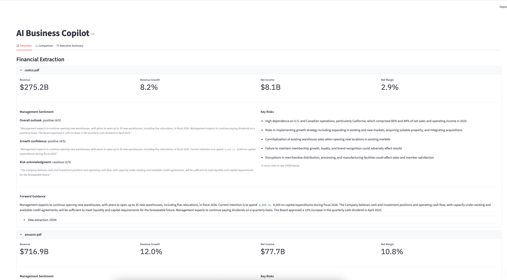
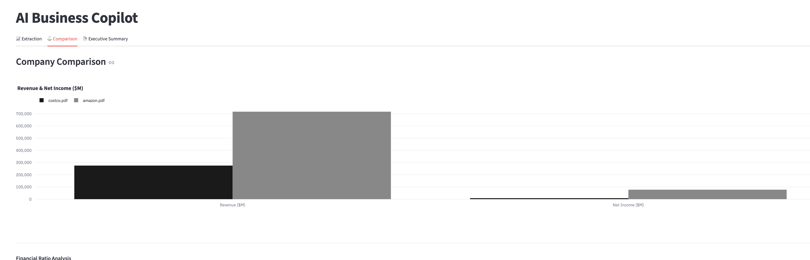
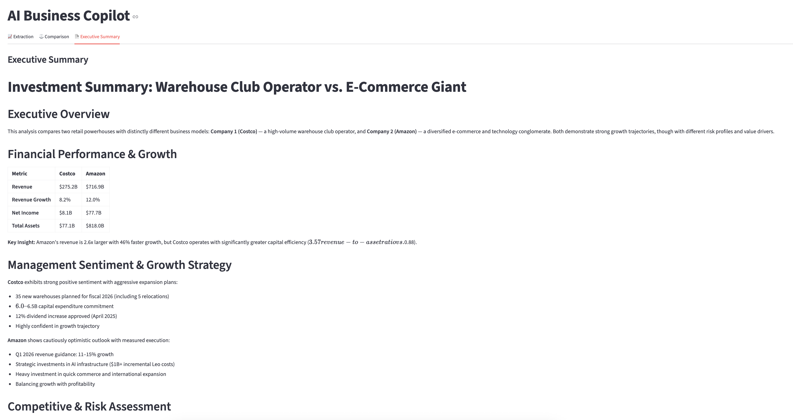

# AI Business Copilot

An AI-powered workflow tool that automates financial analysis of earnings reports — extracting key metrics, analysing management sentiment, comparing companies, and generating executive-ready summaries. Built for consulting and private equity contexts where speed and consistency of analysis matter.

---

## Problem

Consultants and analysts spend hours manually reading earnings transcripts to extract financial metrics, assess management tone, and compare peers. The process is slow, inconsistent across analysts, and hard to scale.

## Solution

A structured AI workflow that ingests earnings report PDFs and produces a complete analysis package in minutes — financial extraction, sentiment scoring, peer comparison, and a one-page executive brief formatted for client presentation.

---

## Demo

> Upload one or more earnings report PDFs → click Run Analysis → results populate across three tabs.

| Tab | What it shows |
| 📈 Extraction | Revenue, growth, net income, EPS, key risks, management sentiment scores |
| ⚖️ Comparison | Side-by-side Plotly chart + DuPont-style ratio analysis across companies |
| 📄 Executive Summary | One-page markdown brief formatted for a Bain or PE client meeting |

  


---

## Architecture

```
PDF Upload (Streamlit)
        │
        ▼
┌─────────────────────────────────────────┐
│           LangGraph Workflow            │
│                                         │
│  extract_node → sentiment_node          │
│                      │                  │
│              ┌───────┴────────┐         │
│              ▼                ▼         │
│        compare_node     summary_node    │
│    (2+ docs only)            │          │
│              └───────┬────────┘         │
│                      ▼                  │
│                 summary_node            │
└─────────────────────────────────────────┘
        │
        ▼
  Streamlit UI (3 tabs)
```

**State flows through the graph as a typed dictionary:**

```
file_paths → extracted_data → sentiment_data → comparison → summary
```

**Conditional routing:** if only one document is uploaded, the workflow skips `compare_node` and routes directly to `summary_node`.

---

## Tools

| Tool | Input | Output | Model |
|---|---|---|---|
| `extract_financials` | PDF file path | JSON: revenue, net income, EPS, growth, risks, forward guidance, competitive mentions | claude-haiku-4-5 |
| `analyze_sentiment` | Forward guidance text | JSON: overall outlook, growth confidence, risk acknowledgment — each with score (1–5), label, and supporting quote | claude-haiku-4-5 |
| `compare_companies` | Dict of extracted financials | JSON: profitability, asset utilisation, asset multiplier ratios with commentary | claude-haiku-4-5 |
| `generate_executive_summary` | Extracted data + sentiment + comparison | Markdown string formatted for client presentation | claude-haiku-4-5 |

Each tool is a plain Python function — independently testable, independently replaceable.

---

## Key Design Decisions

**Structured workflow over autonomous agent.** The analysis pipeline follows a fixed sequence: extract → sentiment → compare → summarise. There is no model-driven routing or self-directed tool selection. This is intentional — enterprise clients need predictable, auditable outputs, not emergent behaviour.

**LangGraph for orchestration.** LangGraph's `StateGraph` manages state passing between nodes and handles conditional branching (single vs multi-document). The typed `State` dictionary enforces schema consistency across the pipeline.

**Claude Haiku for all tool calls.** Speed and cost matter at scale. Haiku handles structured extraction and JSON generation reliably at a fraction of Sonnet's cost. Sonnet would be appropriate for higher-stakes summarisation in a production deployment.

**Plain functions as tools.** Each tool is a standard Python function, not a LangChain abstraction. This keeps the code readable, debuggable, and easy to replace or upgrade independently.

---

## Tech Stack

| Component | Technology | Why |
|---|---|---|
| Orchestration | LangGraph | Structured state graph with conditional routing |
| LLM | Anthropic Claude Haiku | Fast, cost-efficient structured extraction |
| PDF parsing | pypdf | Lightweight, no external dependencies |
| UI | Streamlit | Rapid prototyping, session state management |
| Charts | Plotly | Interactive grouped bar charts |
| Embeddings (search_context) | sentence-transformers `all-MiniLM-L6-v2` | Local embeddings, no API dependency |
| Vector store (search_context) | ChromaDB EphemeralClient | In-memory retrieval, no persistence needed |

---

## Project Structure

```
ai_business_copilot/
├── app.py                  # Streamlit UI
├── workflow.py             # LangGraph graph definition + run_analysis()
├── tool_definitions.py     # JSON schemas for all tools
├── tools/
│   ├── extract_financials.py
│   ├── analyze_sentiment.py
│   ├── compare_companies.py
│   ├── generate_executive_summary.py
│   └── search_context.py
├── documents/              # Sample earnings PDFs
├── requirements.txt
└── .env.example
```

---

## How to Run

**1. Clone and install**
```bash
git clone https://github.com/barrylck/ai-business-copilot
cd ai-business-copilot
pip install -r requirements.txt
```

**2. Set up your API key**
```bash
cp .env.example .env
# add your Anthropic API key to .env
```

`.env`:
```
ANTHROPIC_API_KEY=your_key_here
```

**3. Run**
```bash
streamlit run app.py
```

Opens at `http://localhost:8501`. Upload one or more earnings report PDFs and click **Run Analysis**.

**4. CLI mode (single run without UI)**
```bash
# place PDFs in documents/ folder
python workflow.py
```

---

## Limitations

**Extraction accuracy depends on PDF quality.** `pypdf` extracts text from pages 3–40 of each PDF. Scanned documents, image-heavy reports, or non-standard layouts will produce degraded extraction results.

**Numbers are extracted as reported.** The model extracts figures as they appear in the document. Unit normalisation (millions vs billions, USD vs local currency) is not guaranteed across different reporting formats.

**Comparison requires consistent field availability.** The DuPont-style ratios in `compare_companies` (profitability, asset utilisation, asset multiplier) require revenue, net income, total assets, and shareholder equity. If any field is null in extraction, the corresponding ratio is set to null.

**No persistent storage.** Analysis results live in Streamlit session state and are cleared when the browser tab closes. A production version would require a database layer.

**English-language documents only.** All prompts and extraction logic assume English-language reports.

**Production gap.** A production deployment would additionally require: user authentication, per-query cost tracking, document versioning, approval workflows before client delivery, monitoring and alerting, and multi-language support.

---

## Requirements

```
anthropic
langgraph
streamlit
plotly
pypdf
sentence-transformers
chromadb
python-dotenv
```